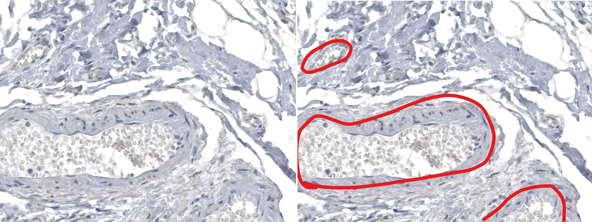
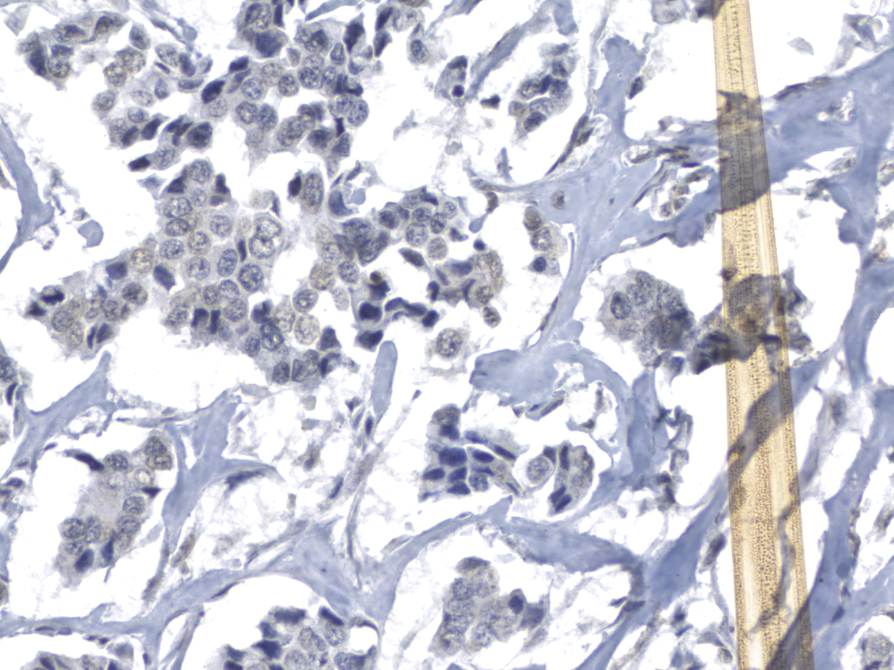
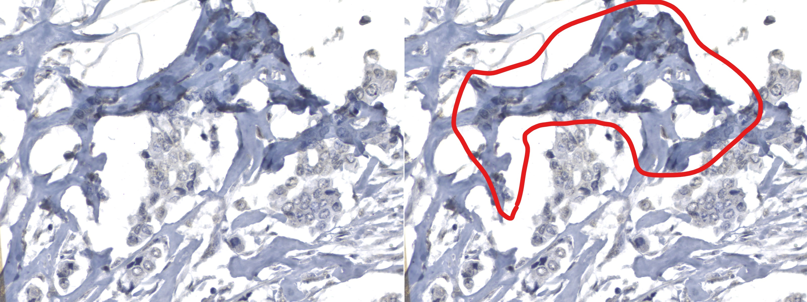

# Medical Image Recognition

This repository hosts a project focused on data analysis and generation of AI models to assist in the process of classifying medical images for cancer stage analysis.

Team: Augusto Pereira, Dionizio, João Victor, Milena Andreuzo, Thalyta Genaro.

Keywords: Data Analysis, Cancer Stage Analysis, AI Models and Machine Learning, Histological Images, Cancer Research, Cell Contamination Detection.

## Description of Problem

**Objective**: The primary objective is to categorize images as either "good" or "bad," aiding in the identification of suitable images for the subsequent cancer stage analysis.

The images utilized in this project were obtained through the scanning of histological slide samples using a CZI format scanner, subsequently converted into JPG format. The dataset was generously provided by the Experimental Pathology Laboratory at the School of Medicine, PUC-PR.

## Resources and Features

- Exploratory data analysis.
- Training AI models for image classification.
- Visualization of classification results.

### Used Technologies

- Programming Language: Python
- Main Libraries: TensorFlow, OpenCV, Scikit-learn
- Virtual Environment: Conda, Google Colab and Jupyter Notebook

## Overview

Histological images are divided into hundreds of fragments, and the percentage of useful images for determining the cancer stage in the sample is approximately 50%.

Before the introduction of our models, this process is carried out manually, consuming a significant amount of time for doctors. The goal is to utilize Data Analysis and AI models to accelerate this initial image selection process.

Image classification plays a crucial role in ensuring that only the most suitable images proceed to the subsequent stage, which involves identifying the cancer stage.

# Examples and Demonstration

The bad fragments to define the stage of cancer normally have these 4 problems:

1. Blood Vessel with Blood cells
   1. RBCs and cancer cells may look alike and get in the way of counting
2. Random artefact above the histological photo
3. Tissue fold
4. With little or no information
   1. Like so much white space

Below we have some examples with this problems:

## Directory Structure

IN PROCESS!

### Important Files

IN PROCESS!

---

## Contribution

Contributions are welcome! If you want to contribute to this project, fell free!

---

## Author

- Name: João Victor
- Contact: josilva602@gmail.com

## License

This project is licensed under the Apache License 2.0 - see the [LICENSE](LICENSE) file for details.

## Contact

For inquiries related to this project, [contact me](mailto:josilva602@gmail.com).

## References and Acknowledgments

- We thank the Experimental Pathology Laboratory - School of Medicine, PUC-PR, for providing the data.
- References used for implementation: [IN PROGRESS!].

## Image Usage and Privacy

Please note that the images used in this project are sourced from real individuals and have been provided solely for the purpose of analysis and AI model creation. To respect privacy and ethical considerations, the actual images will not be displayed. Instead, only the vectorized information and relevant metadata will be presented and discussed in the documentation.

We are committed to handling sensitive data with the utmost care and following ethical guidelines to ensure the responsible and respectful use of this information throughout the project.
